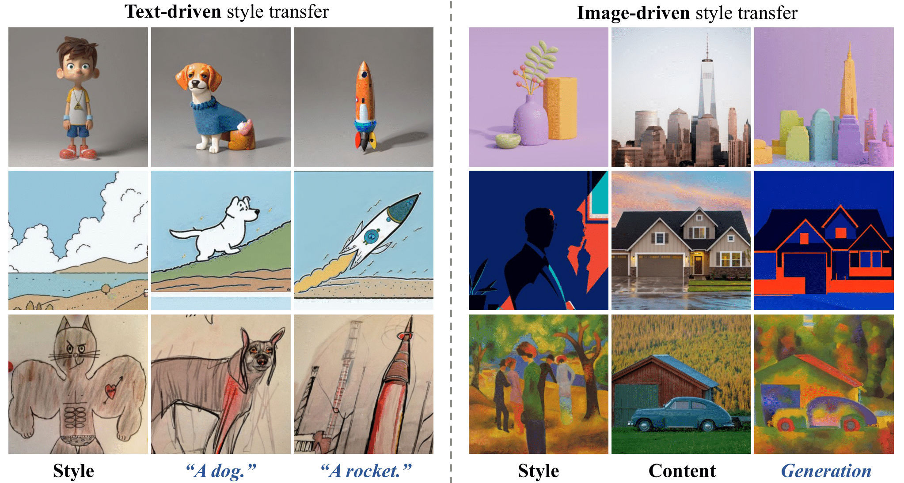

# ___***StyleShot: A SnapShot on Any Style***___

<div align="center">

 <a href='https://arxiv.org/abs/2407.01414'></a> &nbsp;&nbsp;&nbsp;&nbsp;&nbsp;
 <a href='https://styleshot.github.io/'></a> &nbsp;&nbsp;&nbsp;&nbsp;&nbsp;
<a href='https://openxlab.org.cn/apps/detail/lianchen/StyleShot'></a> &nbsp;&nbsp;&nbsp;&nbsp;&nbsp;
<a href='https://huggingface.co/Gaojunyao/StyleShot'></a> &nbsp;&nbsp;&nbsp;&nbsp;&nbsp;

_**[Junyao Gao](https://jeoyal.github.io/home/), Yanchen Liu, [Yanan Sun](https://scholar.google.com/citations?hl=zh-CN&user=6TA1oPkAAAAJ)<sup>&Dagger;</sup>, Yinhao Tang, [Yanhong Zeng](https://zengyh1900.github.io/), [Kai Chen*](https://chenkai.site/), [Cairong Zhao*](https://vill-lab.github.io/)**_
<br><br>
(* corresponding authors, <sup>&Dagger;</sup> project leader)

From Tongji University and Shanghai AI lab.

</div>

## Abstract

In this paper, we show that, a good style representation is crucial and sufficient for generalized style transfer without test-time tuning.
We achieve this through constructing a style-aware encoder and a well-organized style dataset called StyleGallery.
With dedicated design for style learning, this style-aware encoder is trained to extract expressive style representation with decoupling training strategy, and StyleGallery enables the generalization ability.
We further employ a content-fusion encoder to enhance image-driven style transfer.
We highlight that, our approach, named StyleShot, is simple yet effective in mimicking various desired styles, i.e., 3D, flat, abstract or even fine-grained styles, without test-time tuning. Rigorous experiments validate that, StyleShot achieves superior performance across a wide range of styles compared to existing state-of-the-art methods.


## News
- [2024/7/2] 🔥 We release the [paper](https://arxiv.org/abs/2407.01414).
- [2024/7/1] 🔥 We release the code, [checkpoint](https://huggingface.co/Gaojunyao/StyleShot), [project page](https://styleshot.github.io/) and [online demo](https://openxlab.org.cn/apps/detail/lianchen/StyleShot).

## Start

```
# install styleshot
git clone https://github.com/Jeoyal/StyleShot.git
cd StyleShot

# create conda env
conda create -n styleshot python==3.8
conda activate styleshot
pip install -r requirements.txt

# download the models
git lfs install
git clone https://huggingface.co/Gaojunyao/StyleShot
mv StyleShot/pretrained_weight pretrained_weight
rm -r StyleShot
```

## Models

you can download our pretrained weight from [here](https://huggingface.co/Gaojunyao/StyleShot). To run the demo, you should also download the following models:
- [runwayml/stable-diffusion-v1-5](https://huggingface.co/runwayml/stable-diffusion-v1-5)
- [T2I-Adapter Models](https://huggingface.co/TencentARC)
- [ControlNet models](https://huggingface.co/lllyasviel)
- [CLIP Model](https://huggingface.co/laion/CLIP-ViT-H-14-laion2B-s32B-b79K)


## Inference
For inference, you should download the pretrained weight and prepare your own reference style image or content image.

```
# run text-driven style transfer demo
python styleshot_text_driven_demo.py --style "{style_image_path}" --prompt "{prompt}" --output "{save_path}"

# run image-driven style transfer demo
python styleshot_image_driven_demo.py --style "{style_image_path}"  --content "{content_image_path}" --preprocessor "Contour" --prompt "{prompt}" --output "{save_path}"

# integrate styleshot with controlnet and t2i-adapter
python styleshot_t2i-adapter_demo.py --style "{style_image_path}"  --condition "{condtion_image_path}" --prompt "{prompt}" --output "{save_path}"
python styleshot_controlnet_demo.py --style "{style_image_path}"  --condition "{condtion_image_path}" --prompt "{prompt}" --output "{save_path}"
```

- [**styleshot_text_driven_demo**](styleshot_text_driven_demo.py): text-driven style transfer with reference style image and text prompt.

<div align="center">

<p>Text-driven style transfer visualization</p>
</div>

- [**styleshot_image_driven_demo**](styleshot_image_driven_demo.py): image-driven style transfer with reference style image and content image.

<div align="center">

 <p>Image style transfer visualization</p>
</div>

- [**styleshot_controlnet_demo**](styleshot_controlnet_demo.py), [**styleshot_t2i-adapter_demo**](styleshot_t2i-adapter_demo.py): integration with controlnet and t2i-adapter.

## Train
We employ a two-stage training strategy to train our StyleShot for better integration of content and style. For training data, you can use our training dataset [StyleGallery](#style_gallery) or make your own dataset into a json file.

```
# training stage-1, only training the style component.
accelerate launch --num_processes 8 --multi_gpu --mixed_precision "fp16" \
  tutorial_train_styleshot_stage_1.py \
  --pretrained_model_name_or_path="runwayml/stable-diffusion-v1-5/" \
  --image_encoder_path="{image_encoder_path}" \
  --image_json_file="{data.json}" \
  --image_root_path="{image_path}" \
  --mixed_precision="fp16" \
  --resolution=512 \
  --train_batch_size=16 \
  --dataloader_num_workers=4 \
  --learning_rate=1e-04 \
  --weight_decay=0.01 \
  --output_dir="{output_dir}" \
  --save_steps=10000

# training stage-2, only training the content component.
accelerate launch --num_processes 8 --multi_gpu --mixed_precision "fp16" \
  tutorial_train_styleshot_stage_2.py \
  --pretrained_model_name_or_path="runwayml/stable-diffusion-v1-5/" \
  --pretrained_ip_adapter_path="./pretrained_weight/ip.bin" \
  --pretrained_style_encoder_path="./pretrained_weight/style_aware_encoder.bin" \
  --image_encoder_path="{image_encoder_path}" \
  --image_json_file="{data.json}" \
  --image_root_path="{image_path}" \
  --mixed_precision="fp16" \
  --resolution=512 \
  --train_batch_size=16 \
  --dataloader_num_workers=4 \
  --learning_rate=1e-04 \
  --weight_decay=0.01 \
  --output_dir="{output_dir}" \
  --save_steps=10000
```

## StyleGallery<a name="style_gallery"></a>
We have carefully curated a style-balanced dataset, called **StyleGallery**, with extensive diverse image styles drawn from publicly available datasets for training our StyleShot. 
To prepare our dataset StyleGallery, please refer to [tutorial](DATASET.md), or download json file from [here](https://drive.google.com/drive/folders/10T3t58rQKDmYOLschUYj0tzm6zuOngMd?usp=drive_link).

## StyleBench
To address the lack of a benchmark in reference-based stylized generation, we establish a <a href='https://drive.google.com/file/d/1I-Zv5blsrJsckXrvcP_f8TJ4gy6xrwCA/view?usp=drive_link'>style evaluation benchmark</a> containing 73 distinct styles across 490 reference images.

## Disclaimer

We develop this repository for RESEARCH purposes, so it can only be used for personal/research/non-commercial purposes.


## Citation
If you find StyleShot useful for your research and applications, please cite using this BibTeX:
```bibtex
@article{gao2024styleshot,
  title={StyleShot: A Snapshot on Any Style},
  author={Junyao, Gao and Yanchen, Liu and Yanan, Sun and Yinhao, Tang and Yanhong, Zeng and Kai, Chen and Cairong, Zhao},
  booktitle={arXiv preprint arxiv:2407.01414},
  year={2024}
}
```

## Acknowledgements
The code is built upon <a href='https://github.com/tencent-ailab/IP-Adapter'>IP-Adapter</a>.
